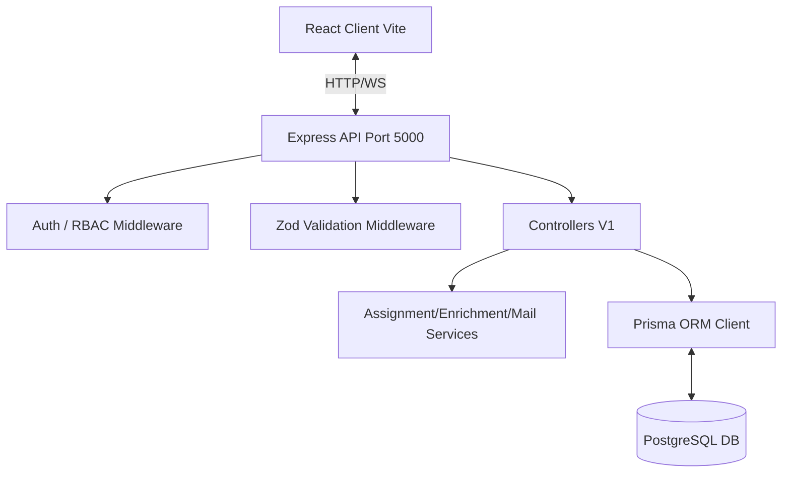
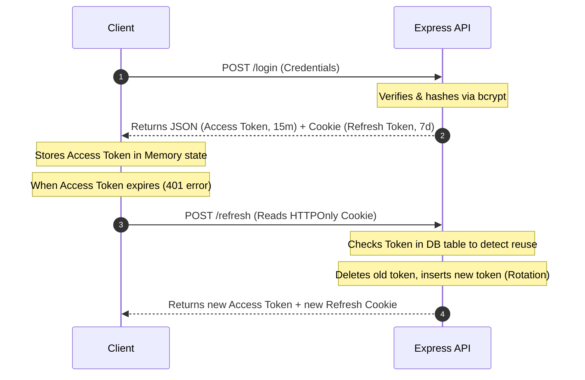

# Mini Lead Management System: Architecture & Technical Presentation

This document contains the presentation slides, design considerations, database schemas, and architectural workflows for technical review. 

An interactive, responsive HTML version of this presentation is available in [architecture_presentation.html](file:///d:/CDAC/companies_related/waaneeAI_Pooja/lead_management_system/architecture_presentation.html).

---

## Slide 1: Cover & Executive Summary
### Project Objective
Create a secure, modern, enterprise-grade CRM Lead Management System that automates assignments, logs operations, updates interfaces in real-time, and guarantees role-based data isolation.

### Core Architecture Pillars
- **Strict Role-Based Access Control (RBAC):** Restricts data views and write endpoints to verified roles.
- **Concurrent-Safe Automation:** Assigns incoming leads to the least-loaded active sales agent instantly using database transaction locking.
- **Auditable Trails:** Maintains logs of logins, modifications, soft-deletes, and status histories.
- **Realtime Collaboration:** Notifies agents of assignments and keeps metrics updated live.

---

## Slide 2: Project Architecture

- **Client Tier:** Single Page Application (React) containing independent route authentication guards and state listeners.
- **Application Tier:** Node.js & Express REST APIs + asynchronous Socket.io WebSocket server.
- **Persistence Tier:** PostgreSQL relational database queried via the type-safe Prisma ORM Client.

---

## Slide 3: Folder Structure
```
backend/
├── prisma/             # Schema, migrations, seeder
├── src/
│   ├── config/         # Logger, db, mail configs
│   ├── controllers/    # Express route handlers
│   ├── services/       # Lead assignment, enrichment
│   ├── routes/         # Router declarations (V1)
│   ├── middlewares/    # Auth, RBAC, UUID validation
│   ├── validations/    # Input schema validation
│   ├── helpers/        # JWT generators, signs
│   ├── sockets/        # Socket event emitters
│   └── tests/          # Jest tests
└── server.js           # Server boot entry point
```
- **Seeding:** Setup scripts in `prisma/seed.js` initialize default roles (Admin, Manager, Agents) for rapid deployment.
- **Route Isolation:** Separation of controllers and routers ensures that router files act only as routing mappings and endpoint guards.
- **Tests Folder:** All unit and middleware test suites are contained directly alongside source code for fast local Jest execution.

---

## Slide 4: Authentication Flow & JWT Rotation

- **Access Token (In-Memory):** A short-lived stateless JWT (15-minute expiry) stored only in client memory.
- **Refresh Token (Secure Cookie):** A database-backed HTTP-only, secure, same-site cookie (7-day expiry).
- **Token Reuse Detection:** If an old/reused refresh token is presented, the server deletes all active refresh tokens for that user, instantly logging out all sessions as a safety countermeasure.

---

## Slide 5: Database Design Decisions
- **Relational Schemas:** Five relational tables manage relational keys and foreign constraints linking leads, users, activity logs, status histories, and session refresh tokens.
- **Indexing Performance:** Applied indexes on `email`, `source`, `status`, `assignedTo`, and `priority` to keep queries constant as the database tables scale.
- **Soft Deletions:** Leads are soft-deleted using a boolean state flag (`is_deleted` + `deleted_at`) preserving historical auditing logs for dashboard compliance checks.
- **Lead Status History:** Every transition of a lead's status is logged into the `lead_status_history` table (recording old state, new state, user ID, timestamp) to analyze conversion times.

---

## Slide 6: Lead Assignment Logic
```mermaid
flowchart TD
  Start[Lead Creation Request] --> Lock[Open Transaction: Serializable Level]
  Lock --> GetAgents[Query Active Users where role = AGENT]
  GetAgents --> GetCounts[For each agent, count open active leads]
  GetCounts --> Sort[Sort Agent list ascending]
  Sort --> Select[Assign Lead to Agent[0] - Least Loaded]
  Select --> Create[Create Lead + ActivityLog records]
  Create --> Commit[Commit Transaction]
  Commit --> Notify[Post-Transaction: Send Email + WebSocket Toast]
```
- **Filter Agents:** Queries active users where role is `AGENT` and `is_active` is true.
- **Aggregate Load:** Counts the number of open, active leads assigned to each agent.
- **Serializable Isolation:** The read, calculation, and lead-creation/assignment writes are encapsulated in a single database transaction set to `Serializable` isolation level. This blocks other transactions from reading stale agent count values, avoiding race conditions.

---

## Slide 7: Scalability Considerations
- **Redis Caching Layer:** Introduce a Redis cache to store general dashboard counts, agent leaderboards, and recent audit logs, reducing database read load by over 80%.
- **RabbitMQ Lead Queue:** Decouple lead ingestion from assignment calculation. Place incoming leads in a queue, processing assignment tasks sequentially to avoid database transaction locks under heavy spikes.
- **Microservices:** Migrate email dispatch (Nodemailer) and domain enrichment scripts (randomuser.me integrations) to decoupled serverless/microservice instances with auto-retry buffers.

---

## Slide 8: Challenges Faced & Resolved
- **Express Routing Parameter Collision:** The general `/users/:id` route was capturing the `/users/agents` endpoint path. This passed the string `'agents'` directly into Prisma UUID queries, throwing database casting exceptions. Resolving it required reordering the router declaration, declaring `/agents` before the parametric `/:id` path.
- **Invalid database UUID casting:** Prisma Client crashed when queries received invalid UUID formats from client requests. Resolution included implementing middleware-level custom regex parameters checks, and adding database exception catching in the global error handler (`errors.js`) to respond with a clean `400 Bad Request` and shield DB query details.
- **Token Hijacking/Cookie Spoofing:** Unsecured JWT access tokens are susceptible to theft if stored in local storage. Deployed access tokens in-memory and HTTP-only secure cookies with SameSite configuration to block script-based access.

---

## Slide 9: Improvements Possible with More Time
- **Elasticsearch Integration:** Support fuzzy search, auto-completion, and dynamic typing search across millions of lead records.
- **Lead Scoring Models:** Integrate Machine Learning classification models to score leads automatically based on priority, agent conversations, and source.
- **Database Read Replicas:** Deploy primary-replica database configurations, routing heavy analytical dashboards queries to replicas to protect write availability.
- **Webhooks System:** Allow integration with Zapier or Slack via custom customer webhook triggers on lead updates.
